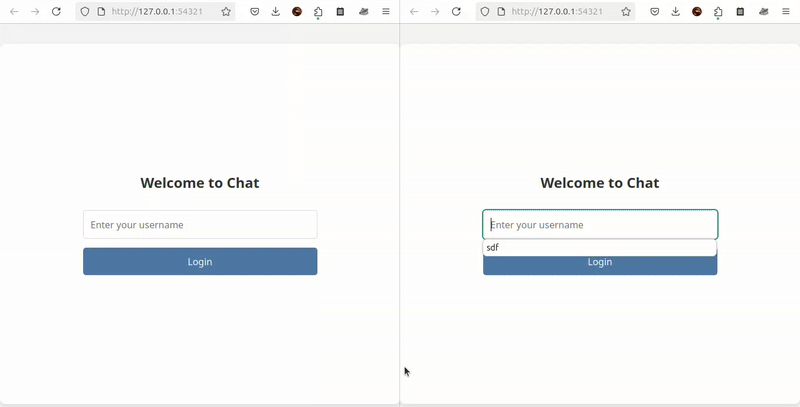

# Socket messenger


### A simple application for transferring text data from one client to all clients connected to the server.
The server side of this app is implemented using Python’s socket library, and data is transmitted via the **TCP** protocol.
On the client side, data is also sent to the server using the socket library.

The **GUI** is built with **Flask**, and it runs in the system’s web browser.

### [run server](#run-server)

### [GUI client](#gui-client)

### [CLI client](#cli-client)

### [Preview](#preview)


### Requirements
```
Flask
dotenv
```

To run this program, you need to create a .env file in the following format and place it in the program's directory

```
HOST = <HOST NAME>      # ex: '127.0.0.1'
PORT = <PORT NUMBER>    # ex: 54321
```


## Run server

for start server, first of all you should create a .env file on root directory of the app and set the listen ip and port:

```
HOST = <HOST NAME>      # ex: '127.0.0.1'
PORT = <PORT NUMBER>    # ex: 54321
```
> By default, the server's IP and port are set to **127.0.0.1** and **65432**.

Then start server:

```
python server.py
```

## GUI client

For start UI client first of all you should set the Flask **port** and **host** in **.env** file:

```
FLASK_HOST = "<HOST NAME>"
FLASK_PORT = "<PORT NUMBER>"
```

> By default, the Flask IP and port are set to **127.0.0.1** and **5001**.

Then start the app.py file:
```
python flask_api/app.py
```

_Then this file give you a **url**, paste it to browsers to access the GUI_


## CLI client

After seting **port** and **ip** in **.env** file run the app:
```
python CLI_client.py
```


## Preview


